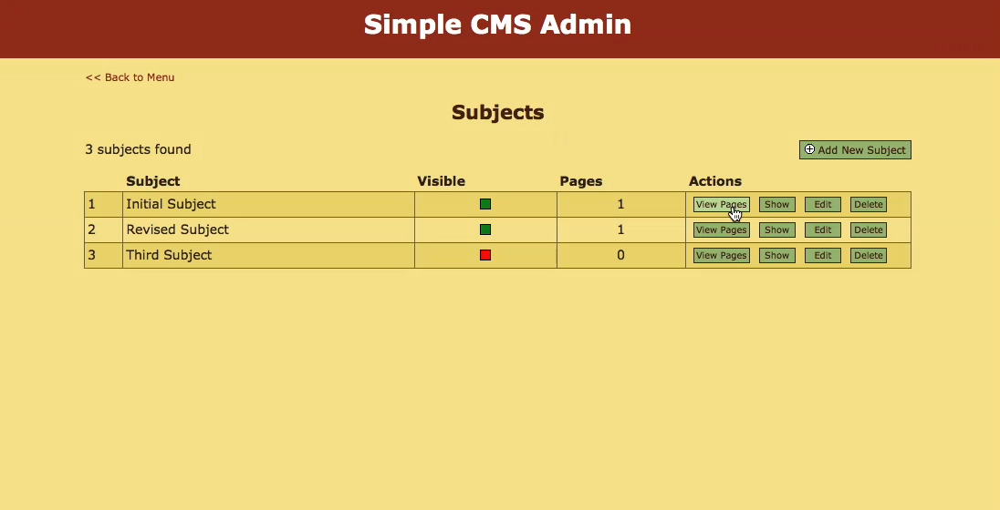
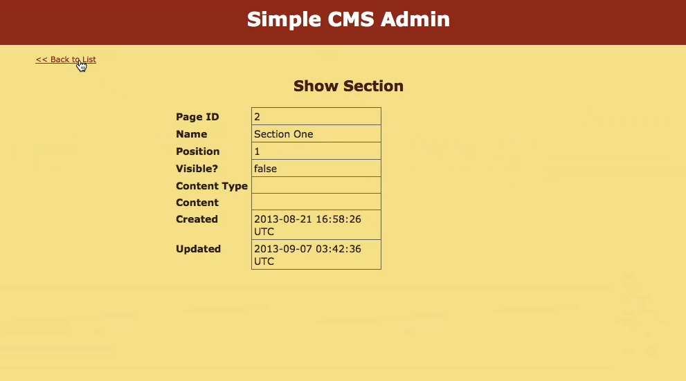
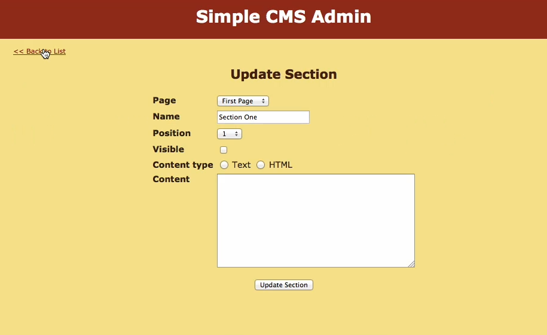
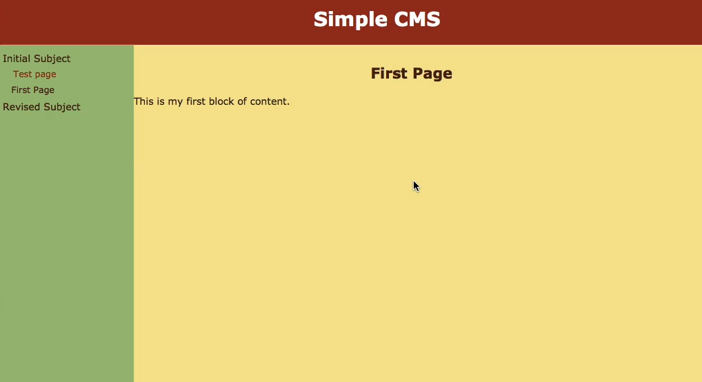

#A Content Management System 

This is a content management system developed to overcome technical and security limitations of other systems. Its ease of use makes it the go-to choice for content managers, content editors. It has a very intuitive user friendly interface. 

##Contributing

Contribution is most welcome, that's the whole idea! Together as a community we can build cool products that can solve real life problems and make our lives easier.

Please take a moment to review the [guidelines for contributing](CONTRIBUTING.md).

* [Bug reports](CONTRIBUTING.md#bugs)
* [Feature requests](CONTRIBUTING.md#features)
* [Pull requests](CONTRIBUTING.md#pull-requests)

